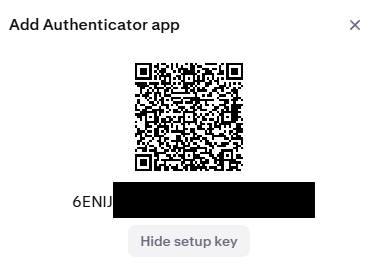

# Playwright Assignment 🚀

This project is an end-to-end testing suite using Playwright. It includes tests for various scenarios, such as login and home page validation, and generates reports using Allure.

## Project Structure 📁

### Key Files and Directories 📂

- **.env**: Environment variables file.
- **.env.SAMPLE**: Sample environment variables file.
- **.github/workflows/playwright.yml**: GitHub Actions workflow for running Playwright tests.
- **Dockerfile**: Docker configuration for setting up the Playwright environment.
- **package.json**: Project dependencies and scripts.
- **playwright.config.ts**: Playwright configuration file.
- **tests/**: Directory containing test specifications and support files.

## Setup 🛠️

### Prerequisites 📋

- Node.js (LTS version recommended)
- Docker (for containerized execution)
- Get Secret_Key from QR Code of 2FA

### Installation 📥

1. Clone the repository:

   ```sh
   git clone https://github.com/manoellvitor/playwright-assignment
   cd playwright-assignment
   ```

2. Install dependencies:

```sh
npm install
```

3. Install Playwright Browser Dependencies:

```sh
npx playwright install
```

4. Copy the sample environment file and fulfill it:

```sh
cp .env.SAMPLE .env
```

5. Fulfill the .env file at the root directory of the project:

```ts
ENVIRONMENT = ""   # Possible Options: "test" | "prod" | "dev" | "staging"
BASE_URL = ""      # Example: "https://www.test.com"
SECRET_KEY = ""    # Secret Key from 2FA
USER_NAME = ""     # User Name
USER_EMAIL = ""    # User Email Address Example: test@test.com
USER_PASSWORD = "" # User Password

```

### Getting SECRET_KEY needed in the .env file

In order to run the tests we need to pass by 2FA, In the project there is a utility function that gets the 2FA token and passes to the Login step, here is tow to get the SECRET_KEY from the 2FA:

1. Login into your account.
2. Go to Security.
3. At Sign-in Two-Factor Authentication (2FA) click on enable Authenticator app.
4. Then you will be prompt to the following popup with a QR code, click on **"View setup key"**
   1. This is your SECRET_KEY.
      
5. With the code copied paste it on the SECRET_KEY variable in the .env file.
   1. Like soo:

```sn
.env
SECRET_KEY = "ADD IT HERE"
```

6. And complete the setup as normal from the web application.
7. Now the Authentication APP will work on both places.

## Running Tests 🧪

### Locally 💻

To run the tests locally and headless, use the following command:

```sh
npm run test
```

To run the tests locally on UI mode, use the following command:

```sh
npm run test:ui
```

To see the test results/report simple run:

```sh
npm run test:results
```

### With Docker 🐳

To build and run the tests using Docker:

1. Build the Docker image:

```sh
docker build -t pw-assignment .
```

2. Run the Docker container:

```sh
docker run --rm pw-assignment
```

## GitHub Actions 🤖

The tests are automatically run on every push and pull request to the **main** or **master** branches using GitHub Actions. The workflow is defined in _.github\workflows\playwright.yml_.

### Playwright HTML Report 📄

The Playwright HTML report is generated automatically after running the tests. You can view it by opening **playwright-report\index.html** in a browser.

# Project Configuration ⚙️

## Playwright Configuration 🛠️

The Playwright configuration is defined in playwright.config.ts.

### Key settings include:

**testDir:** Directory containing the test specifications.
**fullyParallel:** Run tests in parallel.
**retries:** Number of retries on CI.
**reporter:** Reporters used for test results.
**use:** Shared settings for all projects (e.g., baseURL, trace, headless, video, screenshot).

### Environment Variables 🌐

Environment variables are managed using the .env file. Sample variables are provided in .env.SAMPLE.

# Possible Improvements

A better report such as Allure, it is pre-configured in the project but it is not mandatory to use, nor it will affect the test results.

### Allure Report 📄

```sh
Installation guide for Allure: https://allurereport.org/docs/install/
```

To generate and view the Allure report:

1. Run the tests to generate the results:

```sh
npm run test
```

2. Serve the Allure report:

```sh
npm run report:allure
```

### Author

**_*Manoel Lopes*_**
